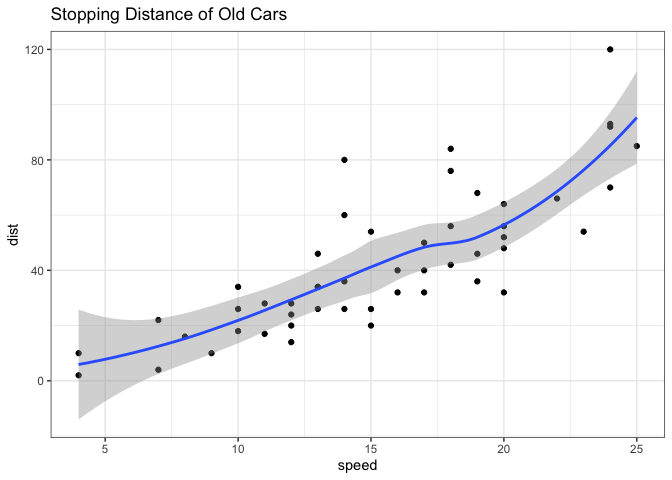
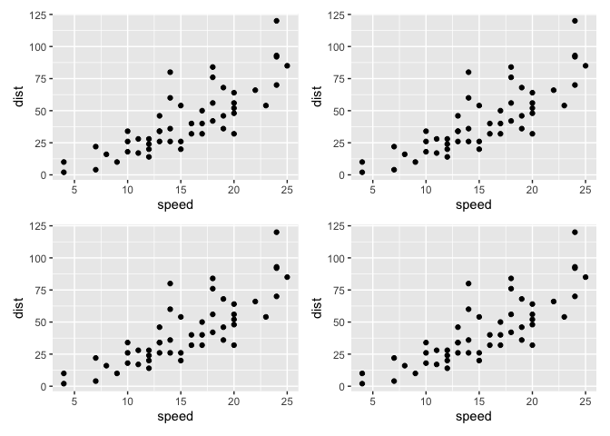

# Class 5: Data Viz with ggplot
Barry (PID: 911)
2024-01-24

## Graphics systems in R

There are many graphics systems for R. These include so-called *“base
R”* and those in add-on packages like `ggplot2`.

``` r
plot(cars)
```


How can we make this with `ggplot2`

This is an add-on package and I first need to install it on my computer.
This install is a one time only deal.

To install any package I use the `install.packages()` function.

To use it we need to load up the package from our library of install
packages. For this I use `library(ggplot2)`

``` r
library(ggplot2)
ggplot(cars)
```


Using ggplot is not as straightforward as base R plot for basic plots. I
have some more typing to do.

Every ggplot has at least 3 things (layers):

- **data** (data.frame)
- **aes** (how the data map to the plot)
- **geoms** (think of this as the type of plot, e.g. points, lines,
  etc.)

``` r
ggplot(cars) +
  aes(x=speed, y=dist) +
  geom_point()
```


Here ggplot was more verbose - i.e. I had more typing to do - than base
R. However, I can add more layers to make nicer and more complicated
plots in an easy way with ggplot.

``` r
ggplot(cars) +
  aes(speed, dist) +
  geom_point() +
  geom_smooth() +
  labs(title = "Stopping Distance of Old Cars") +
  theme_bw()
```

    `geom_smooth()` using method = 'loess' and formula = 'y ~ x'



``` r
pl <- ggplot(cars) +
  aes(x=speed, y=dist) +
  geom_point()

pl
```


``` r
pl + geom_smooth(method="lm", se=FALSE)
```

    `geom_smooth()` using formula = 'y ~ x'


``` r
library(patchwork)

(pl | pl) / (pl | pl)
```



## Lab sheet section 6 onward

``` r
url <- "https://bioboot.github.io/bimm143_S20/class-material/up_down_expression.txt"
genes <- read.delim(url)
head(genes)
```

            Gene Condition1 Condition2      State
    1      A4GNT -3.6808610 -3.4401355 unchanging
    2       AAAS  4.5479580  4.3864126 unchanging
    3      AASDH  3.7190695  3.4787276 unchanging
    4       AATF  5.0784720  5.0151916 unchanging
    5       AATK  0.4711421  0.5598642 unchanging
    6 AB015752.4 -3.6808610 -3.5921390 unchanging

``` r
head(genes, 2)
```

       Gene Condition1 Condition2      State
    1 A4GNT  -3.680861  -3.440135 unchanging
    2  AAAS   4.547958   4.386413 unchanging

> Q. Use the nrow() function to find out how many genes are in this
> dataset. What is your answer?

``` r
nrow(genes)
```

    [1] 5196

> Q. Use the colnames() function and the ncol() function on the genes
> data frame to find out what the column names are (we will need these
> later) and how many columns there are. How many columns did you find?

``` r
ncol(genes)
```

    [1] 4

> Q. Use the table() function on the State column of this data.frame to
> find out how many ‘up’ regulated genes there are. What is your answer?

``` r
table(genes$State)
```


          down unchanging         up 
            72       4997        127 

> Q. Using your values above and 2 significant figures. What fraction of
> total genes is up-regulated in this dataset?

``` r
round(table(genes$State) / nrow(genes) * 100, 2)
```


          down unchanging         up 
          1.39      96.17       2.44 

> Q. Complete the code below to produce the following plot

``` r
p2 <- ggplot(genes) +
  aes(x=Condition1, y=Condition2, col=State, name=Gene) +
  geom_point() +
  scale_colour_manual( values=c("blue","gray","red") ) +
  labs(title="Do it yourself",
       x="Control", y="Drug")
```

And an interactive version with `plotly`

``` r
library(plotly)
```

``` r
#ggplotly(p2)
```
