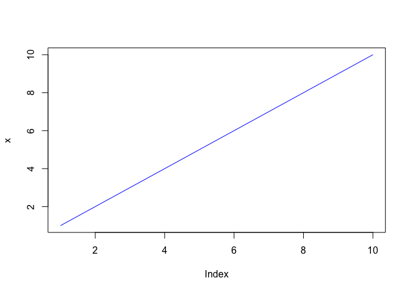

# Class 6: R Functions
Barry (PID: 911)
2024-01-26

# Our first simple silly function

All functions in R have 3 parts. They have:

- a name
- input arguments (none, one or more)
- a body

A function to add two numbers

``` r
sillyadd <- function(x, y=1) {
  x + y
}
```

Let me try out this function.

``` r
sillyadd(100)
```

    [1] 101

# Let’s do something more useful

> Q1. Write a function grade() to determine an overall grade from a
> vector of student homework assignment scores dropping the lowest
> single score. If a student misses a homework (i.e. has an NA value)
> this can be used as a score to be potentially dropped. Your final
> function should be adquately explained with code comments and be able
> to work on an example class gradebook such as this one in CSV format:
> “https://tinyurl.com/gradeinput” \[3pts\]

First I will make a simple version of the problem input where I know
what the answer should be:

``` r
# Example input vectors to start with
student1 <- c(100, 100, 100, 100, 100, 100, 100, 90)
student2 <- c(100, NA, 90, 90, 90, 90, 97, 80)
student3 <- c(90, NA, NA, NA, NA, NA, NA, NA)
```

I will begin by getting a skateboard solution to my tesla problem.

``` r
mean(student1)
```

    [1] 98.75

``` r
min(student1)
```

    [1] 90

``` r
student1
```

    [1] 100 100 100 100 100 100 100  90

``` r
which.min(student1)
```

    [1] 8

``` r
student1[ -8 ]
```

    [1] 100 100 100 100 100 100 100

``` r
x <- student1
# Find lowest value
ind <- which.min(x)
# Exclude lowest value and find mean
mean(x[-ind])
```

    [1] 100

``` r
x <- student3
x
```

    [1] 90 NA NA NA NA NA NA NA

``` r
# Find lowest value
ind <- which.min(x)
ind
```

    [1] 1

``` r
# Exclude lowest value and find mean
mean(x[-ind], na.rm=T)
```

    [1] NaN

``` r
x <- student3

# Find lowest value
ind <- which.min(x)
# Exclude lowest value and find mean
mean(x[-ind], na.rm=T)
```

    [1] NaN

Find and replace the NA values with zero

``` r
x <- 1:5
x
```

    [1] 1 2 3 4 5

``` r
x[x == 3] <- 10000
x
```

    [1]     1     2 10000     4     5

``` r
x <- student2
x
```

    [1] 100  NA  90  90  90  90  97  80

``` r
x[is.na(x)] <- 0
x
```

    [1] 100   0  90  90  90  90  97  80

``` r
x <- student3
x
```

    [1] 90 NA NA NA NA NA NA NA

``` r
x[is.na(x)] <- 0
mean(x[-which.min(x)])
```

    [1] 12.85714

Now we have our working code snippet we can turn it into a function ;-)

``` r
grade <- function(x) {
  x[is.na(x)] <- 0
  mean(x[-which.min(x)])
}
```

``` r
grade(student1)
```

    [1] 100

``` r
grade(student2)
```

    [1] 91

``` r
grade(student3)
```

    [1] 12.85714

Read a class gradebook CSV file from here:
“https://tinyurl.com/gradeinput”

``` r
url <-"https://tinyurl.com/gradeinput"
gradebook <- read.csv(url, row.names = 1)
```

Now use our `grade()` function to grade the whole class….

``` r
head(gradebook)
```

              hw1 hw2 hw3 hw4 hw5
    student-1 100  73 100  88  79
    student-2  85  64  78  89  78
    student-3  83  69  77 100  77
    student-4  88  NA  73 100  76
    student-5  88 100  75  86  79
    student-6  89  78 100  89  77

We can “apply” our new `grade()` function over wither the rows or the
columns of the gradebook, with MARGIN=1 or MARGIN=2.

``` r
results <- apply(gradebook, 1, grade)
results
```

     student-1  student-2  student-3  student-4  student-5  student-6  student-7 
         91.75      82.50      84.25      84.25      88.25      89.00      94.00 
     student-8  student-9 student-10 student-11 student-12 student-13 student-14 
         93.75      87.75      79.00      86.00      91.75      92.25      87.75 
    student-15 student-16 student-17 student-18 student-19 student-20 
         78.75      89.50      88.00      94.50      82.75      82.75 

> **Q2.** Using your grade() function and the supplied gradebook, Who is
> the top scoring student overall in the gradebook? \[3pts\]

``` r
which.max(results)
```

    student-18 
            18 

> **Q3.** From your analysis of the gradebook, which homework was
> toughest on students (i.e. obtained the lowest scores overall?
> \[2pts\]

``` r
apply(gradebook, 2, mean, na.rm=T)
```

         hw1      hw2      hw3      hw4      hw5 
    89.00000 80.88889 80.80000 89.63158 83.42105 

``` r
grade <- function(x, drop.lowest=TRUE) {
  x[is.na(x)] <- 0

  if(drop.lowest) {
    ans <- mean(x[-which.min(x)])
  }
  else {
    ans <- mean(x)
  }
  ans
}
```

A silly plot function

``` r
plotme <- function(x, ...) {
  plot(x, ...)
}

plotme(1:10, col="blue", typ="l")
```



> **Q4.** Optional Extension: From your analysis of the gradebook, which
> homework was most predictive of overall score (i.e. highest
> correlation with average grade score)? \[1pt\]

``` r
mask <- gradebook
mask[is.na(mask)] <- 0

cor( mask$hw5, results)
```

    [1] 0.6325982

``` r
cor( mask$hw3, results)
```

    [1] 0.3042561

Let’s use apply to do this for the whole course!

``` r
apply(mask, 2, cor, y=results)
```

          hw1       hw2       hw3       hw4       hw5 
    0.4250204 0.1767780 0.3042561 0.3810884 0.6325982 
